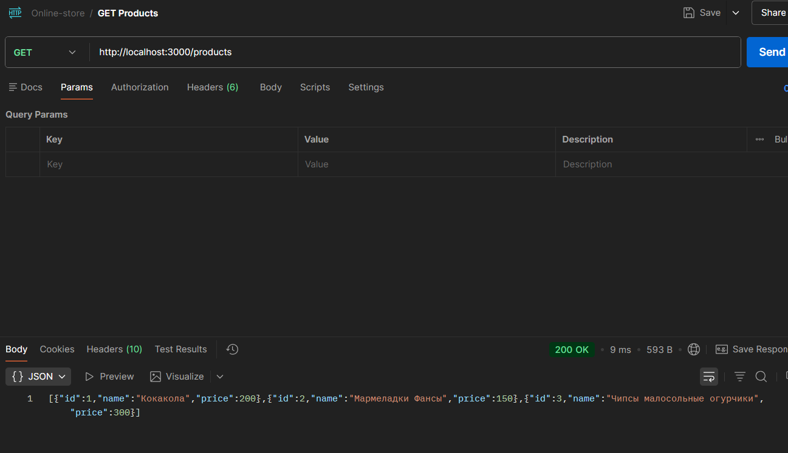
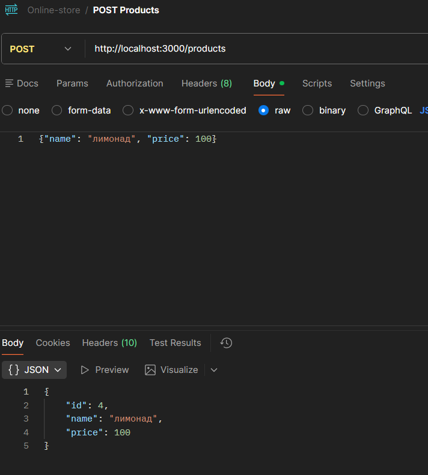
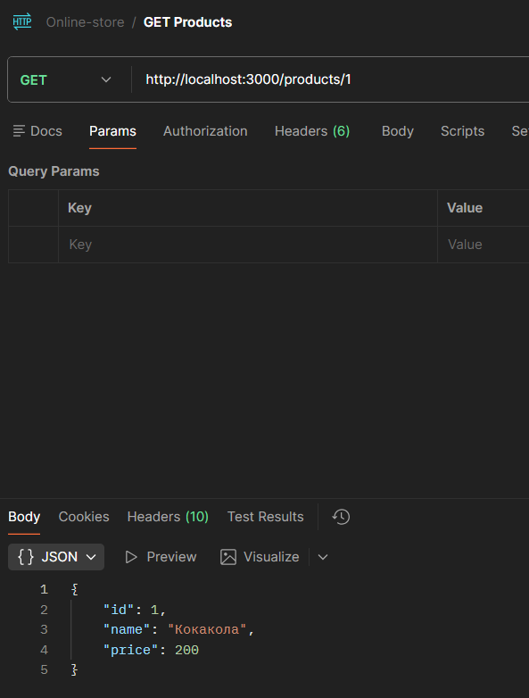
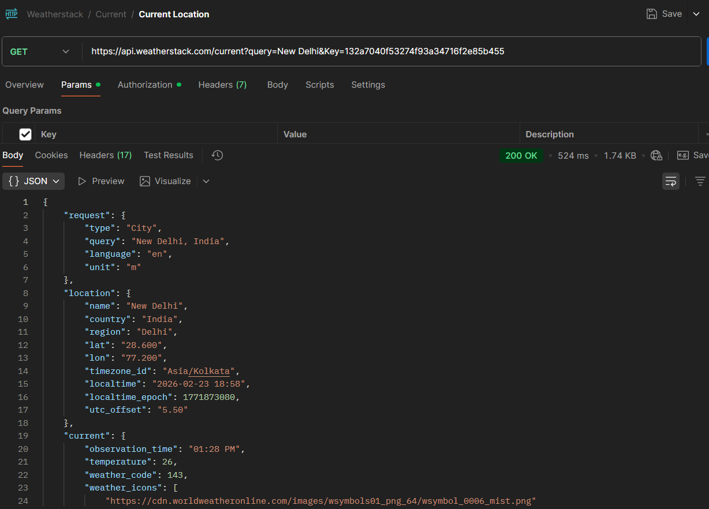
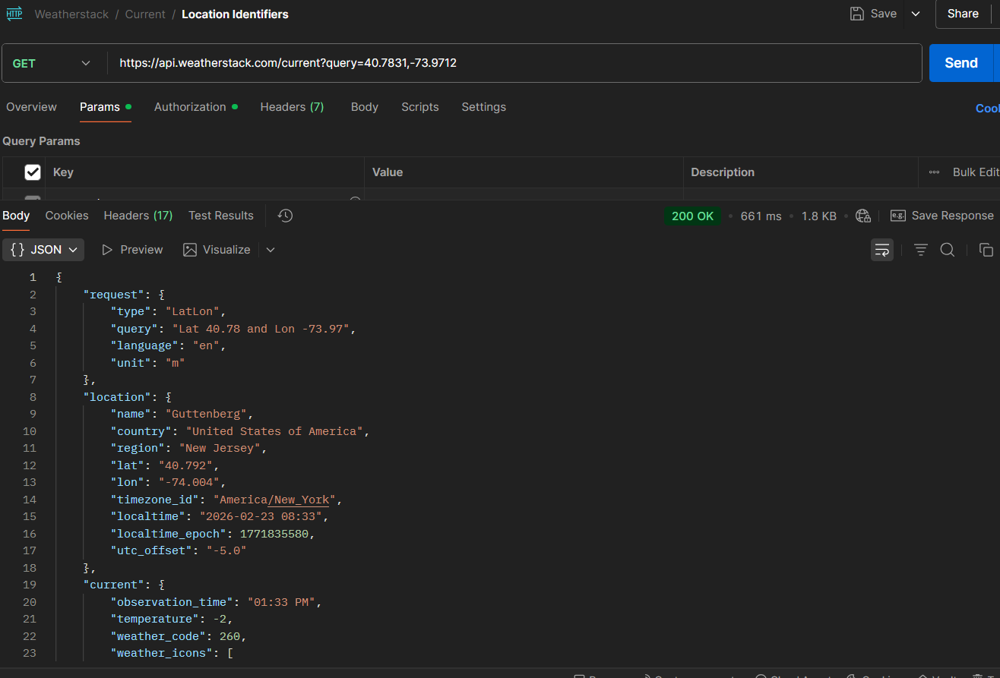
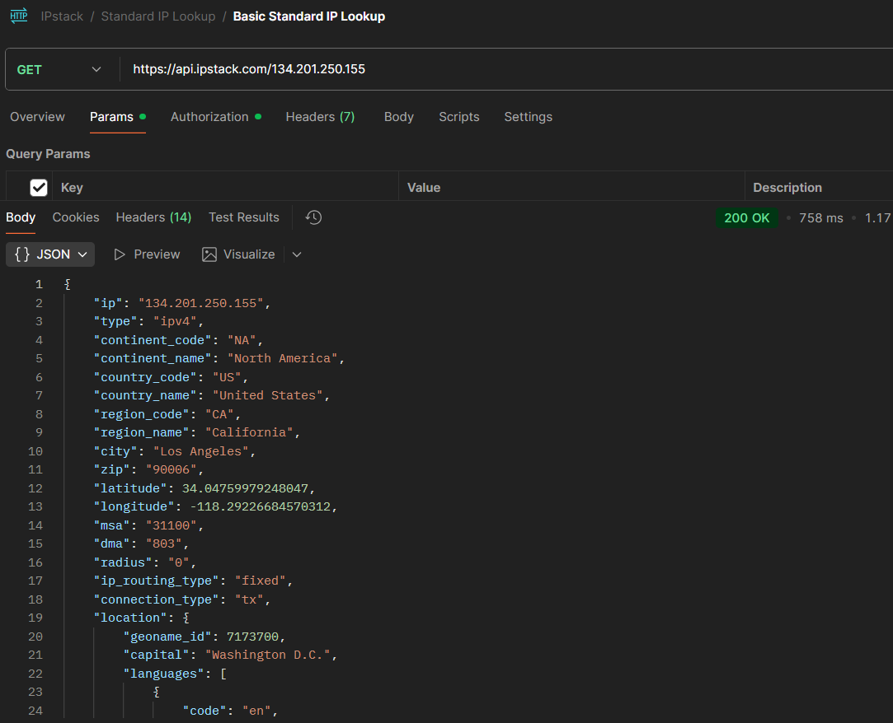
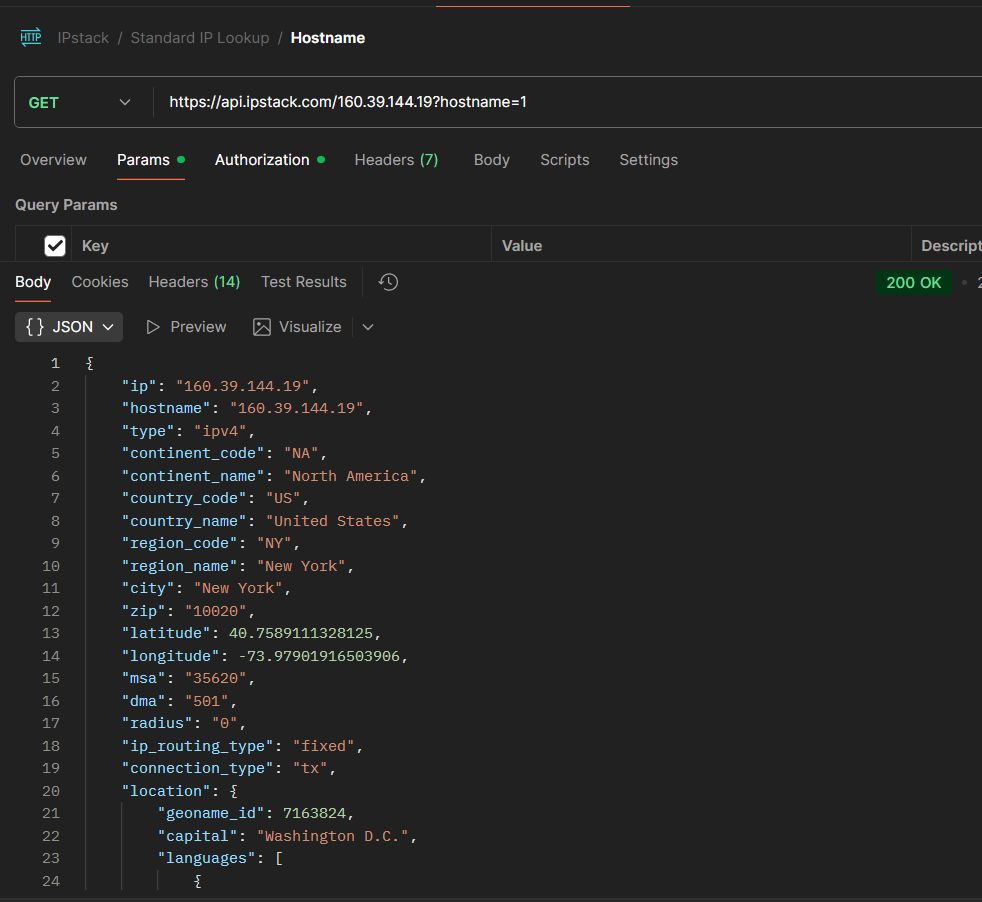
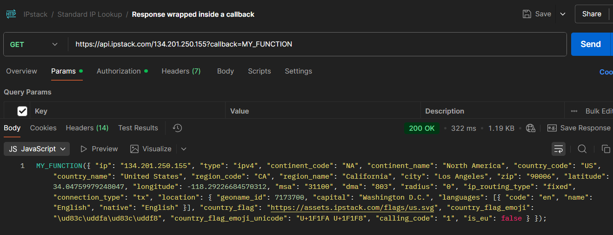

# Контрольная работа №1

Приложения на React и Express - сайт продуктового интернет-магазина.

Эндпоинты
- GET /products - получить все товары
- GET /products/:id - получить товар по ID
- POST /products - создать новый товар
- PATCH /products/:id - обновить товар
- DELETE /products/:id - удалить товар

# Практическое занятие 2:

Реализовано API, которое предоставляет CRUD операции для списка товаров (просмотр всех товаров, просмотр товара по id, добавление товара, редактирование товара, удаление товара). Объект товара содержит следующие поля: id, название, стоимость.

# Практическое занятие 3:

Тестирование API из Практического занятия 2

  

  

  

Тестирование открытых API

Weatherstack:

  

  

IPstack:

  

  

  

# Практическое занятие 4:

Доработан пример из Практического занятия: два небольших приложение на React и Express (для клиента и сервера, соответственно), связанных в единую систему - сайт интернет-магазина товаров. Количество товаров - 10. Карточка товара содержит: название, категорию, описание товара, цену, количество на складе.

# Практическое занятие 5:

Доработано задание из практического занятия №4: подключен swagger-jsdoc и swagger-ui-express, с помощью JSDoc-аннотаций описаны схема пользователя (User) и все CRUD-операции (GET, POST, GET/:id, PATCH/:id, DELETE).